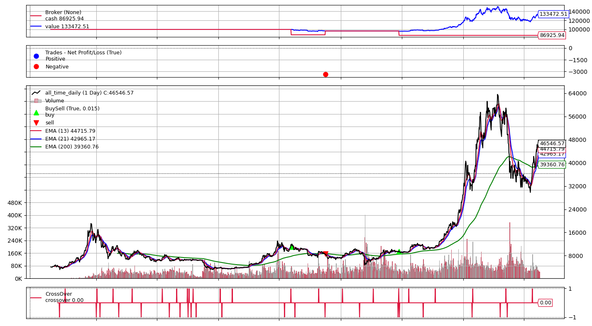

# CoinSentient
A suite of programs for collecting, analysing and implementing data related to cryptocurrencies. Also, allows you to check your balance, place orders from one place. Also includes some custom made indicators based on which some custom strategies are executed (custom indicators/stragies not uploaded here).

# How it looks

## Web App


## Implementing Strategies/Backtesting



## Obtaining Data


# Prerequisites
Wheel, Flask, TALib, Pandas, and others in Requirements.txt

```
pip install csv
pip install wheel
pip install TA_Lib-0.4.21-cp39-cp39-win_amd64.whl 

pip install -r requirements.txt
```

# How to run

Edit fake_config.py and rename it to config.py and modify relevant fields

### Web app interface:
```
.venv\Scripts\activate

flask run
```

### For backtesting strategies:
```
python backtest.py
```

# Strategies

## RSI-Based Strategy:


RSI is calculated as `RSI = 100 - ((100)/1+RS)`
where RS is the average of x days up divided by the average of x days down closes. The strategy buys when RSI dips below 30, and sells when the RSI rises above 70.


## Stochastic RSI Strategy:
The strategy works similar to RSI Strategy, except it uses Stochastic RSI for its working.

## EMA Crossover Strategy:
An Exponential Moving Average is similar to a Simple Moving Average excluding the fact that EMA gives more weightage to more recent data.

The formula is as follow:
`Current EMA = ((Price(current) - previous EMA) X multiplier) + previous EMA`

The most important factor is the smoothing constant that = 2/(1+N) where N = the number of days.
For example:
`A 10-day EMA = 2/(1+10) = 0.1818`

So in a nutshell, the formula becomes:
`EMA = Closing price x multiplier + EMA (previous day) x (1-multiplier)`

The strategy buys whenever:
* the Fast Exponential Moving Average (Length = 13) crosses above the Slow Exponential Moving Average (Length = 21), all while the price maintains itself above the Long EMA (Length = 200).

It sells whenever the vice-versa happens

## EMA Aggressive Setting:
Similar to EMA Crossover, except it disregards the Long EMA, and only checks for crosses.

## Ichimoku:
The strategy buys whenever:
* A TK Cross happens (Base / Conversion Line cross each other in a bullish manner)
* Price also maintains above the Senkou Span

## HODL (Hold Onto Dear Life):
This strategy buys whenever it can, and never sells.


# Misc info about the api, sockets:

* Base endpoint: wss://stream.binance.com:9443

## View data through websockets:
```
wscat -c wss://stream.binance.com:9443/ws/btcusdt@trade / wss://stream.binance.com:9443/ws/btcusdt@kline_5m
```

### Store the data to a file: 

```
wscat -c wss://stream.binance.com:9443/ws/btcusdt@kline_5m | tee dataset.txt
```

Raw streams are accessed at ```/ws/<streamName>```

Combined streams are accessed at ```/stream?streams=<streamName1>/<streamName2>/<streamName3>```

## Trade Streams Payload
```
{
  "e": "trade",     // Event type
  "E": 123456789,   // Event time
  "s": "BNBBTC",    // Symbol
  "t": 12345,       // Trade ID
  "p": "0.001",     // Price
  "q": "100",       // Quantity
  "b": 88,          // Buyer order ID
  "a": 50,          // Seller order ID
  "T": 123456785,   // Trade time
  "m": true,        // Is the buyer the market maker?
  "M": true         // Ignore
}
```

## Kline/Candlestick Charts:
```
{
  "e": "kline",     // Event type
  "E": 123456789,   // Event time
  "s": "BNBBTC",    // Symbol
  "k": {
    "t": 123400000, // Kline start time
    "T": 123460000, // Kline close time
    "s": "BNBBTC",  // Symbol
    "i": "1m",      // Interval
    "f": 100,       // First trade ID
    "L": 200,       // Last trade ID
    "o": "0.0010",  // Open price
    "c": "0.0020",  // Close price
    "h": "0.0025",  // High price
    "l": "0.0015",  // Low price
    "v": "1000",    // Base asset volume
    "n": 100,       // Number of trades
    "x": false,     // Is this kline closed?
    "q": "1.0000",  // Quote asset volume
    "V": "500",     // Taker buy base asset volume
    "Q": "0.500",   // Taker buy quote asset volume
    "B": "123456"   // Ignore
  }
}
```
## KLINE AGGREGATE FORMAT
```
[
  [
    1499040000000,      // Open time
    "0.01634790",       // Open
    "0.80000000",       // High
    "0.01575800",       // Low
    "0.01577100",       // Close
    "148976.11427815",  // Volume
    1499644799999,      // Close time
    "2434.19055334",    // Quote asset volume
    308,                // Number of trades
    "1756.87402397",    // Taker buy base asset volume
    "28.46694368",      // Taker buy quote asset volume
    "17928899.62484339" // Ignore.
  ]
]

```